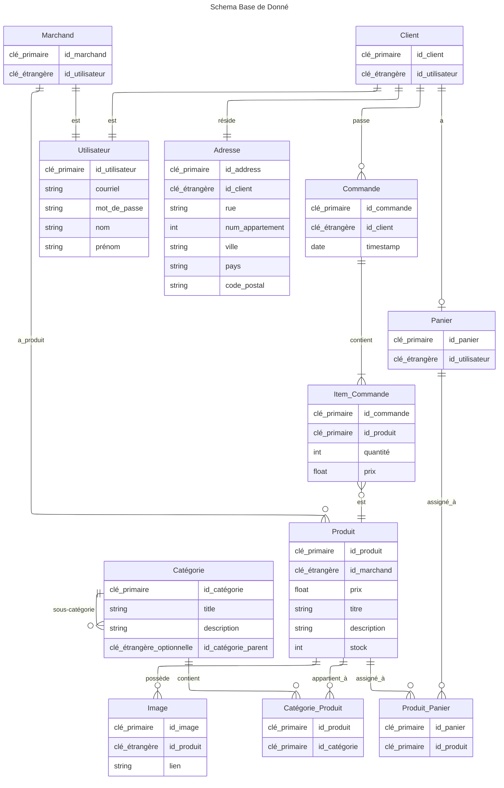

```mermaid
---
title: Schema Base de Donné
config:
    layout: elk
---
erDiagram
    Utilisateur {
        clé_primaire id_utilisateur
        string courriel
        string mot_de_passe
        string nom
        string prénom
    }
    Marchand ||--|| Utilisateur: est
    Marchand {
        clé_primaire id_marchand
        clé_étrangère id_utilisateur
    }
    Client ||--|| Utilisateur: est
    Client {
        clé_primaire id_client
        clé_étrangère id_utilisateur
    }
    Client ||--|| Adresse: réside
    Adresse {
        clé_primaire id_address
        clé_étrangère id_client
        string rue
        int num_appartement
        string ville
        string pays
        string code_postal
    }
    Catégorie ||--o{ Catégorie: sous-catégorie
    Catégorie {
        clé_primaire id_catégorie
        string title
        string description
        clé_étrangère_optionnelle id_catégorie_parent
    }
    Image {
        clé_primaire id_image
        clé_étrangère id_produit
        string lien
    }
    Produit ||--o{ Image: possède
    Marchand ||--o{ Produit: a_produit
    Produit {
        clé_primaire id_produit
        clé_étrangère id_marchand
        float prix
        string titre
        string description
        int stock
    }
    Catégorie ||--o{ Catégorie_Produit: contient
    Produit ||--o{ Catégorie_Produit: appartient_à
    
    Catégorie_Produit {
        clé_primaire id_produit
        clé_primaire id_catégorie
    }
    Client ||--o| Panier: a
    Panier {
        clé_primaire id_panier
        clé_étrangère id_utilisateur
    }
    Panier ||--o{ Produit_Panier: assigné_à
    Produit ||--o{ Produit_Panier: assigné_à
    Produit_Panier{
        clé_primaire id_panier
        clé_primaire id_produit
    }
    Commande ||--|{ Item_Commande : contient
    Client ||--o{ Commande: passe
    Commande {
        clé_primaire id_commande
        clé_étrangère id_client
        date timestamp
    }
    Item_Commande }o--|| Produit: est
    Item_Commande {
        clé_primaire id_commande
        clé_primaire id_produit
        int quantité
        float prix
    }

```